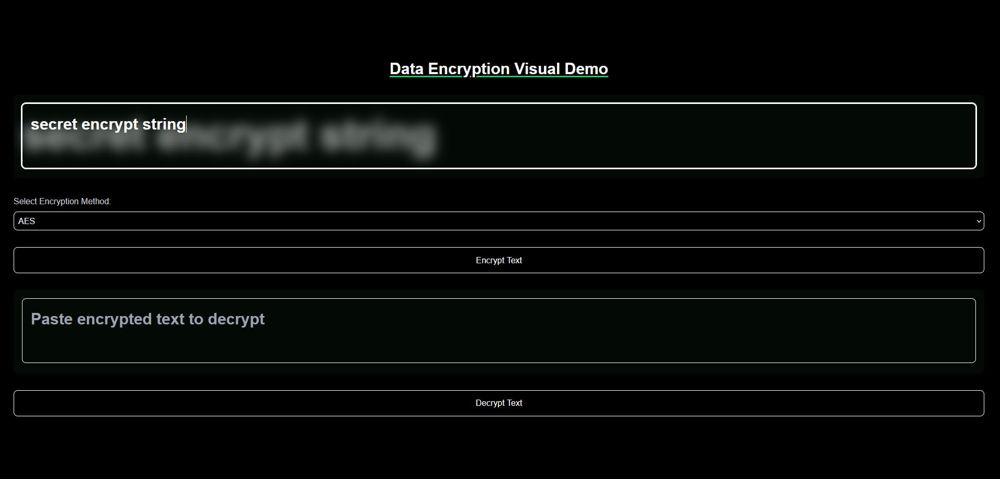
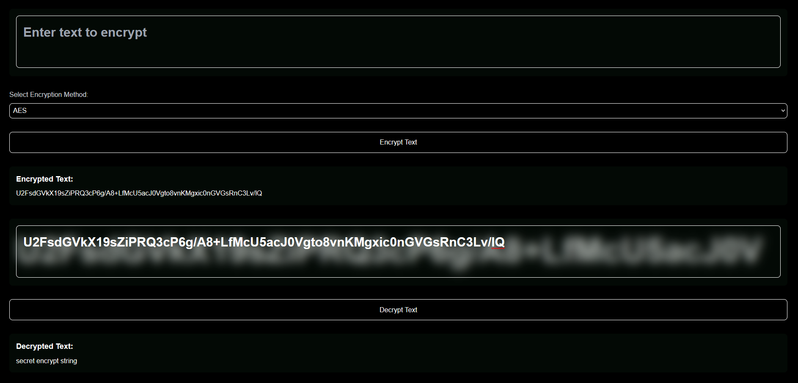

# Data Encryption Visualized

This project shows secure data handling through encryption and decryption. Built with Next.js, TypeScript, and Tailwind CSS, the app uses industry-standard encryption techniques such as AES and DES, along with input sanitization to prevent security vulnerabilities, like XSS (Cross-Site Scripting) attacks.

I used protection methods like Validator.js to protect against common web-based attacks.

# Features

- AES and DES Encryption: Secure encryption methods for protecting sensitive data.

- Input Sanitization: Prevents malicious code injection (XSS).

- Decryption Validation: Ensures that only valid encrypted data can be decrypted.

- Responsive Design: Optimized for both desktop and mobile users.

- Error Handling: User-friendly alerts for encryption or decryption failures.

- Security Focus: Emphasis on safe input handling, especially for use cases involving sensitive information.

# Demo

# How It Works

##### Encrypting Data:

Users can input any string, and choose between AES and DES encryption methods.
The app securely encrypts the input and returns an unreadable string (ciphertext).

##### Decrypting Data:

Users can input previously encrypted text to retrieve the original data.
The app will only decrypt valid ciphertext; any malformed or tampered input triggers an error.

##### Input Sanitization:

Sanitization is performed on all user inputs to escape potentially dangerous characters such as <, >, ', and &, ensuring that malicious code cannot execute, even if attempted. This avoids common security issues such as Cross-Site Scripting (XSS).

##### Error Handling:

If the decryption process fails due to invalid input or tampered data, the app will alert the user and prevent further processing.

## Technologies Used

**Next.js:** React framework for server-side rendering and performance optimization.

**TypeScript:** Strongly typed JavaScript for building scalable, maintainable apps.

**Tailwind CSS:** Utility-first CSS framework for custom styling.

**CryptoJS:** Encryption and decryption library for secure data handling.

**Validator:** Ensures input is safe and sanitized to prevent security risks.

**ESLint:** Enforces code quality and security best practices.

# Installation and Setup

1. Clone the Repository:

> git clone https://github.com/your-username/data-encryption-visual-demo.git

2. Navigate to the Project Directory:

> cd data-encryption-visual-demo

3. Install Dependencies:

> npm install

4. Run the Development Server:

> npm run dev

Navigate to http://localhost:3000 in your browser to view the app.

# Future Enhancements

- User Authentication: Integrate user authentication to ensure only authorized users can access and encrypt/decrypt data.

- More Encryption Methods: Add more encryption algorithms like RSA.

# License

This project is licensed under the MIT License. See the [LICENSE](LICENSE) file for details.
